# Hardware Setup

## Components

| Component | Notes |
|---|---|
| Raspberry Pi 5 | 4GB or 8GB |
| Freenove 5" DSI screen | 800x480, FT5x06 capacitive touch |
| OV5647 camera | Or any Pi-compatible CSI camera |
| CSN-A4L thermal printer | USB + TTL serial; we use USB |
| Arcade button (24mm illuminated) | .110 spade terminals |
| 12V LiPo battery | Main power source |
| 12V to 5V DC-DC converter | Steps battery down to 5V |
| WAGO lever connectors (3-port) | Distributes 5V to Pi and printer |

## System Diagram



## Power architecture

This build runs entirely off a 12V LiPo battery. The power chain looks like this:

```
12V LiPo battery
      |
      v
12V to 5V DC-DC converter
      |
      v
   +5V rail  -----+----- WAGO connector (+)  ---> Pi GPIO pin 2 (5V)
      |           |
      |           +----- WAGO connector (+)  ---> Printer VH (pin 3)
      |
   GND rail  -----+----- WAGO connector (-)  ---> Pi GPIO pin 6 (GND)
                  |
                  +----- WAGO connector (-)  ---> Printer GND (pin 1)
```

Two 3-port WAGO lever connectors join the converter's 5V output to both loads in parallel:

- **WAGO #1 (positive rail):** converter +5V in, Pi 5V GPIO out, printer VH out
- **WAGO #2 (ground rail):** converter GND in, Pi GND GPIO out, printer GND out

A WAGO is a junction connector - all three ports are on the same electrical node, so both the Pi and the printer are pulling from the same 5V supply in parallel.

### Powering the Pi via GPIO 5V (pin 2) - what to know

This build feeds the Pi through GPIO pin 2 (5V) and pin 6 (GND) **rather than the USB-C port**. This is the simplest way to integrate the Pi into a battery-powered project that already has a 5V rail, but it has trade-offs:

- **No protection.** The Pi 5's USB-C input has a polyfuse, reverse-polarity protection, and inrush current limiting. The GPIO 5V pin bypasses all of that. A short or surge in the wiring will go straight into the Pi's power management chip.
- **No PD negotiation.** The Pi 5 normally requests 5V/5A via USB-C Power Delivery. When fed via GPIO, it just runs on whatever the rail is providing. Make sure the rail is solidly 5.0V (not 4.8 or 5.2) under load. Sag below ~4.7V can cause undervoltage warnings or instability; rising above 5.25V can damage the Pi.
- **No undervoltage detection on boot.** If the battery sags badly during boot, the Pi may not warn you the way a USB-C supply would.

For a permanent build, a USB-C breakout board (terminal block on one side, USB-C plug on the other) is safer and only costs a few dollars more. It lets the WAGO feed the breakout, and the breakout connects via USB-C to the Pi - keeping all the protection circuitry in play. If you replicate this setup and care about reliability, do it that way.

The current GPIO-feed approach works fine for a project where the battery is well-regulated and the wiring is short and clean, just be aware of the risk profile.

### Why the Pi and printer share the same converter

Earlier in development the printer was powered separately (Pi on a wall USB-C, printer on its own 5V supply) because the print head's 1.5A peak draw was suspected to be browning out a single shared supply. Once the DC-DC converter was confirmed to handle the combined load (5V/5A rated, well above the ~3-4A combined steady draw), it was simpler to consolidate to one battery + converter via WAGOs.

If you replicate this and run into print quality issues that look like power sag (blank prints, faint prints, Pi resetting during prints), split them onto separate supplies.

## Critical notes

### Pi 5 needs 22-pin camera/display cables

The Pi 5's CAM/DISP ports are 22-pin / 0.5mm pitch - physically different from older Pi 4 cameras' 15-pin / 1.0mm cables. If your camera or screen came with the older cable, you'll need a 22 to 15-pin adapter cable.

### Camera must be in the OTHER CAM/DISP port from the screen

Pi 5 has two ports, both labeled CAM/DISP. They're functionally identical, but only one camera and one display can be connected at a time. Use one for the screen, the other for the camera.

## Wiring summary

### Camera (OV5647)
Connected via Pi 5 22-pin CAM/DISP port (whichever one isn't used by the screen). 22-pin end at the Pi, 15-pin end at the camera board.

### Display (Freenove DSI)
Connected via the other Pi 5 22-pin CAM/DISP port using the included 16cm "for 5" cable. Touch input is delivered over the same DSI cable - no separate USB needed.

### Thermal printer (CSN-A4L)
Connected to the Pi via USB cable to any USB-A port for data. Power comes from the WAGO setup described above:
- Printer power port pin 1 (GND) -> WAGO ground rail
- Printer power port pin 3 (VH) -> WAGO +5V rail
- The TTL data port on the printer is unused

### Arcade button (24mm illuminated)

The button has 4 spade terminals: 2 for the microswitch, 2 for the LED. Standard arcade button quick-connect crimp wires (.110 size, female spade) didn't grip the Pi's GPIO header reliably, and DuPont-to-spade adapters were loose inside the spade housings. To get a solid, permanent connection, the spade quick-connects were cut off and **wires were soldered directly to the wires that go to the GPIO header**.

| Button terminal | Pi GPIO header pin | Function |
|---|---|---|
| Microswitch (1) | Pin 9 | GND |
| Microswitch (2) | Pin 11 (GPIO 17) | Input |
| LED (+) | Pin 4 (5V) or shared with WAGO +5V | 5V |
| LED (-) | Pin 14 | GND |

The microswitch is not polarity-sensitive - either of its two terminals can go to GND or to GPIO. The LED has marked + and - terminals on the gray plastic housing.

The Pi's internal pull-up resistor on GPIO 17 is enabled in software (via `gpiozero.Button(17, pull_up=True)`), so no external resistor is needed for the button.

Note: GPIO pin 2 is being used by the WAGO 5V feed. The button LED uses **pin 4** (the other 5V pin) instead.

## Initial setup gotchas

- **Always shut down before adjusting CSI/DSI cables.** Hot-plugging can damage connectors.
- **Camera detection happens at boot.** If you reseat a CSI cable, you must reboot for the kernel to re-scan; the system will not pick up a newly connected camera mid-session.
- **The printer auto-detects as `/dev/usb/lp0`** on Bookworm. No driver needed.
- **The DSI screen auto-detects** with `display_auto_detect=1` - no overlay needed for the Freenove panel.
- **WAGO lever connectors** require ~10mm of stripped wire and the lever fully lifted before insertion. Always tug-test each wire after closing the lever.
- **Verify converter output voltage** before first power-up. The DC-DC converter should output a stable 5.0V (4.95-5.10V is acceptable). If it's outside that range, do not connect the Pi - either adjust the converter (if adjustable) or replace it.